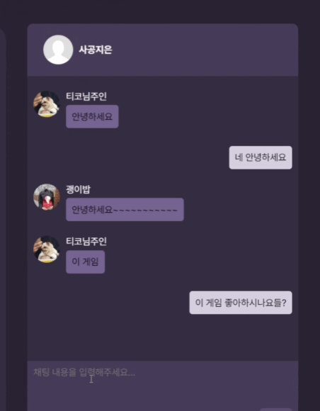
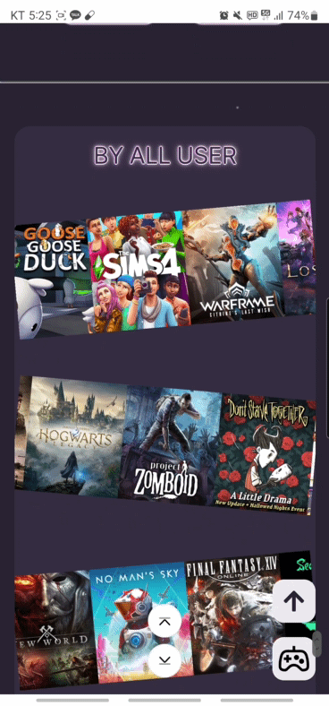
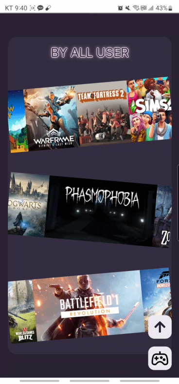
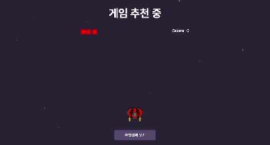
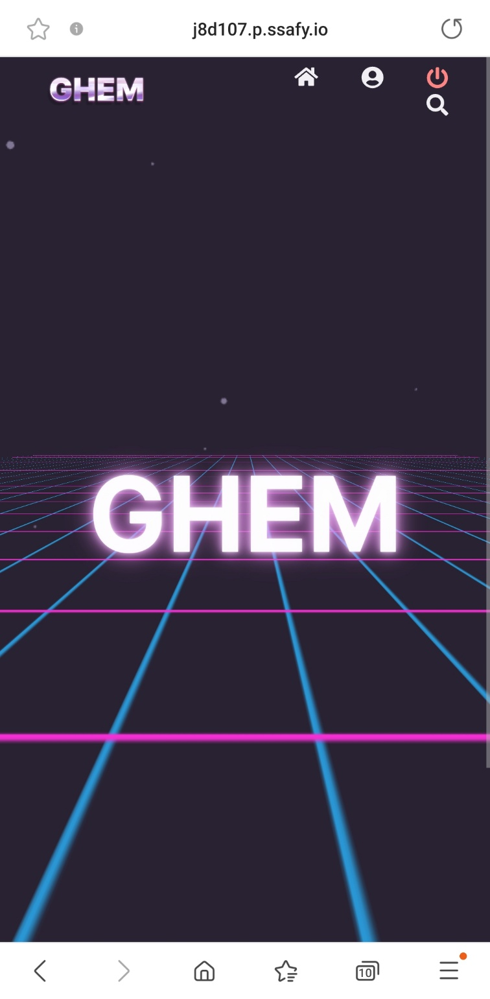
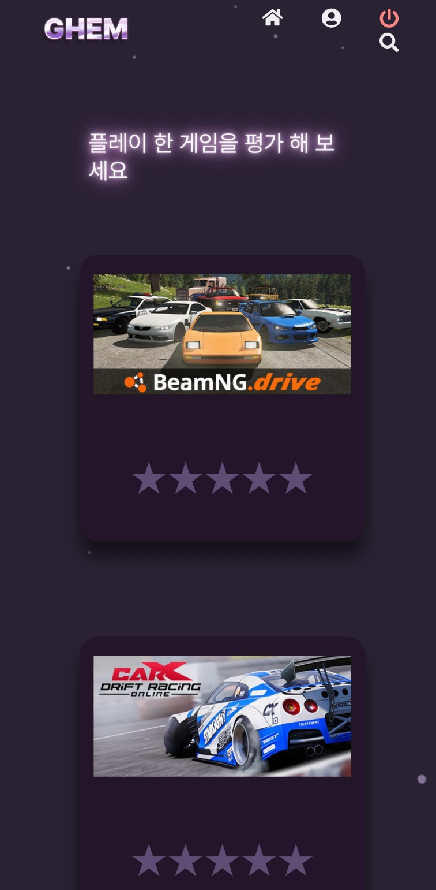
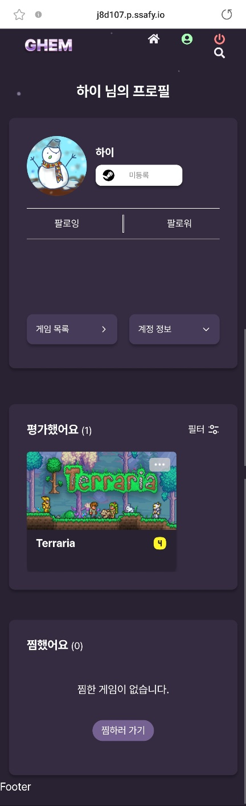
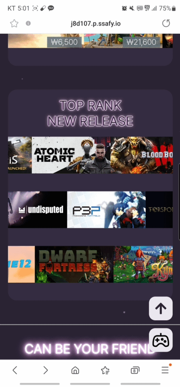

# GHEM 🕹️

[1️⃣ 프로젝트 소개](#프로젝트-소개-💻)  
[2️⃣ 기술 스택](#기술-스택-🔨)  
[3️⃣ 핵심 기능](#핵심-기능-🌟)  
[4️⃣ 서브 기능](#서브-기능-⭐)  
[5️⃣ 인프라 구조](#인프라-구조-🔧)  
[6️⃣ 화면 구성](#화면-구성-💻)  

 

## 프로젝트 소개 💻

### 주제

#### 빅데이터 기반의 개인 맞춤형 스팀 게임 추천 웹 서비스

- [발표 자료](./docs/ghem_pdf.pdf)
- [UCC](https://youtu.be/WAnrTIMFzoY)

### 진행 기간

2023.02.20 ~ 2023.04.07

### 팀원 소개

#### FrontEnd

- 이용훈 : 게임 상세페이지 및 채팅 구현
- 이시준 : 추천결과페이지 구현
- 김민지 : 웰컴페이지 구현
- 사공지은 : 로그인 및 마이프로필 관련 기능 구현

#### BackEnd

- 이석원 : 백엔드 및 인프라 구현

 

## 기술 스택 🔨

### 프론트엔드

### 백엔드

### 인프라

### 공통

 

## 핵심 기능 🌟

#### 소셜 로그인

- OAuth 기반의 카카오, 네이버 소셜 로그인
- Steam openID 연동 로그인

#### 취향 맞춤 게임 추천

- 유저 게임 기반의 협업 필터링을 이용한 게임 추천
- 유사한 유저를 추천
- 유사한 게임을 추천

#### 채팅

- rabbitMQ를 활용한 채팅 서버 구축 및 실시간 채팅 구현

 

## 서브 기능 ⭐

#### 비로그인 게임 추천

- 비로그인 시에도 사이트를 체험할 수 있도록 플레이해 본 게임을 등록 가능하도록 설정
- 등록한 게임 기반으로 비슷한 게임을 선별해서 메인페이지에 결과 출력.

#### 게임 검색 창 기능

- 검색 창을 이용하여 바로 상세 페이지로 이동 가능도록 설정
- 검색어를 0.5초 이내 입력시 axios interceptor를 활용하여 필요하지 않은 요청을 제거

#### 게임 필터 기능

- 성인, 폭력 등 수위가 높은 게임의 경우 유저의 프로필에 입력된 나이를 확인하여 필터 기능을 탑재 및 토글 버튼을 통해 필터 on/off 가능

#### 관심 없어요 기능

- 게임 상세정보 혹은 hover 시의 정보에서 관심없어요 체크 가능. 3초의 유예 시간이 주어지며 이후 곧바로 추천 리스트에서 보이지 않게 처리

#### 자동 & 드래그 드랍 캐러셀

- 라이브러리 사용 없이 자동으로 흘러가듯 움직이는 캐러셀을 구현
- 드래그 앤 드랍을 통한 캐러셀 스크롤 이동이 가능하도록 구현
- 모바일, PC 모두 지원

#### 미니 게임

- 빅데이터를 통한 머신러닝에 필요한 시간 동안 사용자가 지루함을 느끼지 않도록 TypeScript를 사용한 미니 게임 구현

#### 반응형으로 모바일 웹 지원

- 터치 스크린 구분을 통해 PC에서 마우스 hover시의 화면을 터치 스크린에서는 터치를 통해 확인할 수 있도록 구현
- 수월한 반응형 구현을 위해 세세한 컴포넌트 분리

 

## 인프라 구조 🔧

- 각 서버 분리를 통한 MSA 방식으로 대량 트래픽에 대응하는 머신러닝 학습 인프라 구축
- 쿠버네티스를 활용한 사용자 증감에 따른 오토스케일링 및 스케일 조절 적용
- 로드 밸런싱을 통해 빠른 추천 결과 제공을 위한 인프라 구성

## 화면 구성 💻

- [화면 구성 보러 가기](https://profuse-school-12a.notion.site/fcad6ed6e69847d69dfa5901b219a89b)
